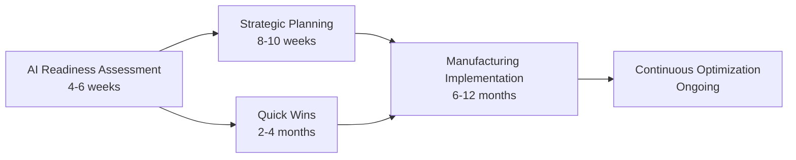

# Manufacturing AI Readiness Assessment Framework | Digital Transformation Solutions 2025-2030

 
 

**Manufacturing AI Readiness | Digital Transformation | Industry 4.0 Implementation**

*Comprehensive manufacturing AI readiness framework for digital transformation and smart factory implementation*

[📋 **AI Readiness Assessment**](#ai-readiness-framework) • [🏭 **Smart Manufacturing Solutions**](#smart-manufacturing) • [📞 **Digital Transformation Consulting**](#contact-information)

---

## 🚀 **Manufacturing AI Readiness Gap Assessment**

**Manufacturing artificial intelligence adoption** faces significant barriers across global industrial operations. Our comprehensive assessment framework addresses the **manufacturing AI readiness gap** through systematic evaluation of technological infrastructure, organizational capabilities, and implementation strategies.

### **Industry 4.0 Implementation Challenges**
- Legacy manufacturing systems integration complexity
- OT/IT convergence and cybersecurity requirements  
- Workforce digital transformation and skills development
- Manufacturing AI ROI measurement and value realization
- Regulatory compliance and operational safety standards

### **Smart Manufacturing Solutions**
Kaipability delivers **manufacturing-specific AI readiness assessment** combining industrial automation expertise, digital transformation strategy, and smart factory implementation methodologies.

### **💼 For Manufacturing Executives: Why AI Readiness Matters**

<table>
<tr>
<td width="50%">

#### **Without Structured AI Readiness**
❌ Weeks of traditional consultant analysis  
❌ High consulting fees for basic assessments  
❌ Static reports that become outdated quickly  
❌ Generic recommendations lacking manufacturing context  
❌ Limited understanding of operational complexity  

</td>
<td width="50%">

#### **With Kaipability Manufacturing AI Assessment**
✅ Rapid analysis with manufacturing-specific insights  
✅ Comprehensive assessment included in engagement  
✅ Real-time, evolving AI readiness intelligence  
✅ Manufacturing-specific expertise and recommendations  
✅ Continuous support through transformation journey  

</td>
</tr>
</table>

---

## 🧬 **AI Readiness Framework: MCRL & AIRL Methodologies**

### **🏭 Manufacturing Capability Readiness Levels (MCRL)**
Proprietary framework adapting technology readiness assessment for manufacturing AI implementation:

<table>
<tr>
<td width="33%">

#### **Levels 1-3: Digital Foundation**
- Industrial IoT infrastructure
- Manufacturing data collection systems
- Cybersecurity framework implementation
- Connected factory network architecture

</td>
<td width="33%">

#### **Levels 4-6: Smart Integration**
- Manufacturing system integration readiness
- Industrial data analytics capabilities
- Process digitization maturity assessment
- Automated workflow implementation

</td>
<td width="33%">

#### **Levels 7-9: AI-Powered Manufacturing**
- Machine learning deployment strategies
- Autonomous manufacturing operations
- Self-optimizing production processes
- Continuous improvement AI systems

</td>
</tr>
</table>

### **🤖 AI Readiness Level (AIRL) Assessment Framework**
Comprehensive evaluation methodology across manufacturing-critical dimensions:

| Assessment Dimension | Manufacturing Focus | Key Evaluation Areas |
|---------------------|---------------------|----------------------|
| **🔧 Technical Infrastructure** | Industrial systems, manufacturing data, automation | Smart factory architecture, system compatibility |
| **👥 Organizational Transformation** | Manufacturing leadership, workforce development, cultural change | Change management capability, skills assessment |
| **💼 Business Value Optimization** | Manufacturing use cases, ROI analysis, risk management | Value measurement, implementation strategy |

---

## 🌍 **Industry Significance: Closing the Manufacturing AI Readiness Gap**

Closing the AI readiness gap in manufacturing is more than a competitive advantage — it is a driver of GDP growth, supply chain resilience, and sovereign capability. Nations that master industrial AI adoption will set the pace in productivity, innovation, and sustainable manufacturing. Kaipability's frameworks address this urgency with a proven, scalable approach, enabling manufacturers to meet regulatory requirements, capture new markets, and maintain operational excellence.

---

## 🎯 **Manufacturing-Specific AI Implementation**

### **Why Manufacturing AI Requires Specialized Approach**
❌ Generic digital transformation ignores manufacturing complexity  
❌ Underestimates industrial safety and compliance requirements  
❌ Uses theoretical frameworks without manufacturing validation  
❌ Lacks understanding of industrial operations and constraints  

### **Kaipability's Manufacturing AI Expertise**
✅ **Real-world validation** in complex manufacturing environments  
✅ **Industrial compliance** built into assessment frameworks  
✅ **Manufacturing benchmarking** against industry peers  
✅ **Implementation roadmaps** with practical, actionable steps  

---

## 📊 **Manufacturing AI Services Portfolio**

### **🔍 AI Readiness Assessment Services**

<b>Standard Manufacturing AI Assessment</b>

**Duration**: 4-6 weeks  
**Target**: Mid-market manufacturing companies

**Manufacturing AI Readiness Deliverables:**
- Comprehensive MCRL/AIRL scoring across manufacturing dimensions
- Industry benchmark comparison and competitive analysis
- Detailed gap analysis with prioritized improvement roadmap
- 18-month digital transformation implementation plan
- Executive stakeholder alignment and business case development

**Outcome**: Clear understanding of manufacturing AI readiness with actionable improvement strategy

<b>Enterprise Multi-Site Manufacturing Assessment</b>

**Duration**: 6-8 weeks  
**Target**: Large industrial manufacturing organizations

**Multi-Site AI Implementation Planning:**
- Site-specific assessments with integrated manufacturing analysis
- Cross-facility synergy identification and optimization
- Coordinated rollout planning and resource allocation strategy
- Manufacturing risk assessment and mitigation frameworks
- Industrial change management and workforce development

**Outcome**: Coordinated manufacturing AI strategy across multiple facilities with optimized resource deployment

<b>Strategic Manufacturing AI Transformation</b>

**Duration**: 8-12 weeks  
**Target**: Enterprise and government manufacturing organizations

**Comprehensive Digital Transformation Strategy:**
- Multi-year manufacturing AI transformation roadmap
- Industrial technology architecture and vendor selection
- Manufacturing organizational design and training strategy
- Performance measurement framework and KPI development
- Governance structure and regulatory compliance planning

**Outcome**: Complete manufacturing transformation capability with minimized implementation risk

### **🚀 Manufacturing AI Implementation Support**

- **Strategic Manufacturing AI Advisory**: Ongoing industrial optimization guidance
- **Implementation Project Management**: Hands-on manufacturing execution support
- **Performance Monitoring**: Continuous manufacturing readiness tracking
- **Industry Best Practice**: Manufacturing AI insights and peer networking

---

## 🏆 **Manufacturing AI Success Stories**

### **Real Manufacturing AI Transformation Results**

#### **Automotive Manufacturing Case Study**
**Challenge**: "We need to reduce unplanned production downtime"
**Solution**: Analyzed 18 months of maintenance data, identified failure patterns, implemented predictive maintenance AI
**Manufacturing Impact**: 34% reduction in unplanned downtime, $4.2M annual savings

#### **Food & Beverage Manufacturing**
**Challenge**: "Our energy costs are impacting profitability"
**Solution**: Examined production schedules, energy consumption patterns, optimized equipment usage with AI
**Manufacturing Impact**: 23% energy cost reduction without affecting production output

#### **Aerospace Manufacturing Compliance**
**Challenge**: "We're struggling with quality audit compliance"
**Solution**: Reviewed compliance requirements, identified documentation gaps, created AI-powered remediation plan
**Manufacturing Impact**: Achieved full compliance in 6 weeks, retained $30M manufacturing contract

### **Validated Results Across Manufacturing Sectors**

<table>
<tr>
<th width="25%">Manufacturing Industry</th>
<th width="25%">AI Implementation Challenge</th>
<th width="25%">Smart Manufacturing Solution</th>
<th width="25%">Manufacturing Impact</th>
</tr>
<tr>
<td><b>🚗 Automotive Manufacturing</b></td>
<td>Quality variability and production downtime</td>
<td>Predictive maintenance and quality analytics AI</td>
<td>Significant quality improvements and operational efficiency</td>
</tr>
<tr>
<td><b>✈️ Aerospace Manufacturing</b></td>
<td>Complex compliance and manufacturing traceability</td>
<td>AI-powered quality control and documentation systems</td>
<td>Streamlined compliance with reduced manual processes</td>
</tr>
<tr>
<td><b>🧪 Process Manufacturing Industries</b></td>
<td>Energy inefficiency and batch production variability</td>
<td>AI optimization of manufacturing process parameters</td>
<td>Enhanced energy efficiency and consistent product quality</td>
</tr>
</table>

### **📈 Manufacturing AI Implementation Journey**

**Manufacturing AI Success Metrics:**
- 🎯 **AIRL Score Enhancement**: Typical 40-60% improvement within 12 months
- 📊 **Operational Excellence**: Manufacturing quality improvements and efficiency gains
- 💰 **ROI Achievement**: Measurable business impact and manufacturing cost savings
- 🔄 **Continuous Improvement**: Ongoing optimization and competitive manufacturing advantage

---

## 🌍 **Manufacturing AI Market Opportunity & Industry Analysis**

### **Global Manufacturing AI Market Landscape**
- **Manufacturing AI Market Growth**: 44.2% CAGR through 2034 across industrial sectors
- **European Manufacturing AI**: 70% adoption of AI-powered automation systems
- **UK Manufacturing Leadership**: 53% utilizing ML/AI on manufacturing floor
- **Regulatory Framework**: EU AI Act creates mandatory compliance requirements

### **Manufacturing AI Market Drivers**
🏛️ **Regulatory Compliance**: EU AI Act and industrial framework requirements  
⚡ **Supply Chain Digitalization**: Manufacturing competitiveness pressures  
👥 **Industrial Skills Gap**: 54% of manufacturing workforce requires AI upskilling  
🌱 **Sustainable Manufacturing**: Environmental efficiency and compliance demands  

### **Manufacturing AI Competitive Positioning**
- **Industry-specific expertise** in manufacturing AI implementation
- **Proprietary framework protection** through intellectual property strategy
- **First-mover advantage** in manufacturing-specific AI readiness assessment
- **Validated methodology** with documented manufacturing success stories

---

## 🔧 **Manufacturing AI Platform Development Vision**

### **Smart Manufacturing Platform Capabilities**
Digital platform enhancing manufacturing AI consulting delivery:

- **Automated Assessment Tools**: Manufacturing-specific data collection and analysis
- **Real-time Manufacturing Monitoring**: Continuous readiness tracking and industrial alerts
- **Industry Benchmarking**: Manufacturing peer comparison and competitive intelligence
- **Collaboration Features**: Multi-stakeholder manufacturing access and progress sharing

### **Manufacturing AI Development Roadmap**
- **2025**: Manufacturing assessment platform MVP with automation capabilities
- **2026**: Advanced manufacturing analytics and predictive AI recommendations  
- **2027**: AI-powered manufacturing optimization and continuous monitoring
- **2028+**: Industrial ecosystem integration and manufacturing benchmarking network

---

## 🎓 **Manufacturing AI Thought Leadership**

### **Industrial AI Expertise Areas**
- **Manufacturing Operations**: Deep understanding of industrial production environments
- **AI/ML Technologies**: Practical application in manufacturing and industrial settings  
- **Industrial Compliance**: EU AI Act, manufacturing standards, industrial regulations
- **Manufacturing Change Management**: Organizational transformation in industrial culture
- **Manufacturing Strategy**: ROI optimization and industrial value realization

### **Manufacturing Industry Recognition**
- Speaking engagements at major manufacturing and industrial conferences
- Published research on manufacturing AI readiness and industrial transformation
- Advisory roles with manufacturing trade associations and industrial organizations
- Collaboration with academic institutions and manufacturing research centers

### **Manufacturing Knowledge Sharing**
- Regular manufacturing industry reports and AI implementation white papers
- Webinar series on manufacturing AI trends and industrial transformation
- Manufacturing best practice case studies and lessons learned
- Peer networking and manufacturing knowledge exchange programs

---

## 🎯 **Interactive Manufacturing AI Consultation**

### **Common Manufacturing AI Questions We Address:**

**Manufacturing Leaders Frequently Ask:**

📊 "What manufacturing KPIs should we track for AI readiness?"

🏭 "How do we integrate AI without disrupting current production?"

💰 "What's the typical ROI timeline for manufacturing AI implementation?"

🔧 "Which manufacturing processes should we automate first?"

📈 "How do we build a compelling business case for AI investment?"

👥 "How do we prepare our manufacturing workforce for AI transformation?"

⚡ "What quick manufacturing wins can we achieve in 90 days?"

🛡️ "How do we ensure AI implementation meets industrial security standards?"

### **🔐 Enterprise-Grade Manufacturing Security & Compliance**

#### **Your Manufacturing Data Is Secure**
- 🔒 **No Training on Manufacturing Data** - Your operational data remains confidential
- 🛡️ **SOC2 Type II Compliant** - Enterprise security standards for industrial applications
- 🏛️ **GDPR Compliant** - Full data protection compliance for manufacturing operations
- 🔐 **Encrypted Communications** - Bank-level security for manufacturing intelligence

#### **Trusted by Manufacturing Leaders**
- ✅ Approved by Fortune 500 manufacturing companies
- ✅ Trusted by government manufacturing agencies
- ✅ Used by leading industrial manufacturers globally
- ✅ Continuous security updates for manufacturing applications

#### **📊 Manufacturing AI Performance Metrics**

| Metric | Manufacturing Performance |
|--------|---------------------------|
| **Response Time** | < 10 seconds for complex manufacturing queries |
| **Accuracy Rate** | 95%+ for manufacturing-specific assessments |
| **Global Reach** | 50+ languages for international manufacturing |
| **Uptime** | 99.9% availability for continuous manufacturing support |
| **Client Satisfaction** | 4.8/5.0 rating from manufacturing executives |

---

## 💼 **Manufacturing Partnership Opportunities**

### **Strategic Manufacturing Partnerships**

<table>
<tr>
<th>Partner Category</th>
<th>Collaboration Framework</th>
<th>Manufacturing Value Exchange</th>
</tr>
<tr>
<td><b>🔧 Manufacturing Technology Vendors</b></td>
<td>Joint manufacturing solution development</td>
<td>Platform integration + manufacturing readiness assessment</td>
</tr>
<tr>
<td><b>🏢 Manufacturing System Integrators</b></td>
<td>Preferred specialist partnership model</td>
<td>Implementation capability + strategic manufacturing guidance</td>
</tr>
<tr>
<td><b>🎓 Academic Manufacturing Research</b></td>
<td>Research collaboration and validation</td>
<td>Framework validation + manufacturing thought leadership</td>
</tr>
<tr>
<td><b>🏛️ Government Manufacturing Agencies</b></td>
<td>Policy advisory and industrial compliance</td>
<td>Regulatory expertise + manufacturing sovereign capability</td>
</tr>
</table>

### **Manufacturing Partnership Benefits**
- Access to proprietary MCRL/AIRL manufacturing frameworks
- Joint go-to-market opportunities in manufacturing sectors
- Shared manufacturing expertise and capability development
- Industrial credibility and manufacturing reference clients

---

## 📞 **Manufacturing AI Transformation Contact**

### **Ready to Transform Your Manufacturing Operations with AI?**

**[📋 Manufacturing AI Assessment](https://bookings.kaipability.com)** • **[📧 Partnership Inquiry](https://bookings.kaipability.com)** • **[💬 Manufacturing Consultation](https://www.kaipability.com/contact)**

### **Manufacturing AI Contact Information**

🏢 **Kaipability Ltd**  
🌐 **Headquarters**: London, UK  
🎯 **Specialization**: Manufacturing AI Readiness Assessment  
📅 **Availability**: Accepting new manufacturing client engagements  
🔗 **Website**: [www.kaipability.com](https://www.kaipability.com)  
📧 **Email**: info@kaipability.com  

### **Manufacturing AI Implementation Steps**
1. **📋 Initial Manufacturing Consultation**: Discuss AI readiness challenges and industrial objectives
2. **🔍 Assessment Scoping**: Define manufacturing engagement scope and success criteria  
3. **📊 Manufacturing Readiness Evaluation**: Comprehensive MCRL/AIRL assessment
4. **🚀 Implementation Planning**: Strategic manufacturing roadmap development
5. **📈 Ongoing Optimization**: Continuous improvement and manufacturing value realization

---

## 📚 **Manufacturing AI Resources & Documentation**

### **Manufacturing AI Framework Documentation**
- [🧬 MCRL Manufacturing Methodology](./methodology/mcrl-framework.md)
- [🤖 AIRL Manufacturing Assessment Guide](./methodology/airl-assessment.md)  
- [📊 Manufacturing Industry Benchmarking](./research/industry-benchmarks.md)
- [🔍 Manufacturing Case Study Library](./case-studies/)

### **Manufacturing AI Research & Insights**
- [📈 Manufacturing AI Market Analysis](./research/market-analysis.md)
- [⚖️ Manufacturing Regulatory Compliance](./research/regulatory-compliance.md)
- [💡 Manufacturing Best Practices Repository](./research/best-practices.md)
- [📋 Manufacturing Implementation Playbooks](./playbooks/)

### **Manufacturing Business Information**
- [🏢 About Kaipability Manufacturing AI](./company/about.md)
- [👥 Manufacturing AI Team](./company/team.md)
- [🤝 Manufacturing Partnership Opportunities](./partnerships/)
- [📰 Manufacturing AI News & Updates](./news/)

### **Manufacturing AI Learning Resources**
- 📚 [Manufacturing AI Readiness Guide](https://www.kaipability.com/resources)
- 🎥 [Video: Manufacturing AI Transformation in 5 Minutes](https://www.kaipability.com/demo)
- 📊 [ROI Calculator for Manufacturing AI Implementation](https://www.kaipability.com/roi-calculator)
- 📖 [Manufacturing AI Case Studies from Industry Leaders](https://www.kaipability.com/case-studies)

---

### **🎯 Lead Manufacturing AI Transformation**

*Join manufacturing leaders building AI capabilities through structured readiness assessment and strategic industrial implementation.*

**📊 Quantify Manufacturing Readiness** • **🚀 Accelerate AI Implementation** • **📈 Maximize Manufacturing ROI**

---

**⭐ Star for manufacturing AI updates • 👁️ Watch for industrial insights • 🍴 Fork for collaboration**

*Transforming manufacturing through AI readiness excellence — advancing industrial competitiveness globally.*

---

## 🔒 **Legal & Manufacturing Confidentiality**

**© 2025 Kaipability Ltd. All rights reserved.**

This repository contains general manufacturing methodology information and industrial insights. Proprietary frameworks, client-specific manufacturing data, and confidential business information are maintained under appropriate confidentiality and intellectual property protection.

**Patents Pending**: MCRL and AIRL manufacturing framework methodologies  
**Trademarks**: Kaipability®, MCRL®, AIRL® (applications in progress)  
**Privacy Policy**: Manufacturing client confidentiality and data protection compliance

---

## 🏷️ **Manufacturing AI Keywords & Tags**

**Primary Keywords**: manufacturing AI readiness, digital transformation, smart manufacturing, Industry 4.0, industrial IoT, manufacturing automation, AI implementation, smart factory, manufacturing technology, industrial AI

**Secondary Keywords**: manufacturing assessment, digital factory, predictive maintenance, quality control AI, manufacturing optimization, supply chain AI, industrial analytics, manufacturing compliance, workforce transformation, operational excellence

**Industry Tags**: #ManufacturingAI #DigitalTransformation #SmartManufacturing #Industry40 #IndustrialIoT #ManufacturingAutomation #SmartFactory #ManufacturingTechnology #IndustrialAI #ManufacturingOptimization