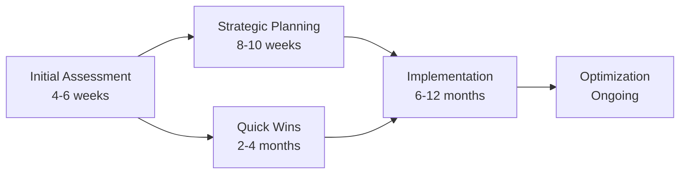

# 🏭 Kaipability — Manufacturing AI Readiness Excellence

**Transforming Manufacturing Through Structured AI Implementation**

*The only manufacturing-specific AI readiness framework that quantifies capability gaps and provides actionable improvement roadmaps*

[📋 **Explore Our Methodology**](#our-methodology) • [🎯 **See Client Impact**](#client-success) • [📞 **Get In Touch**](#contact)

---

## 🚀 **The Manufacturing AI Readiness Gap**

**87% of manufacturing companies lack structured AI readiness frameworks** despite recognizing AI's transformative potential. This creates a massive opportunity for organizations that can systematically assess, plan, and implement AI capabilities.

### **The Challenge**
- Complex manufacturing environments with legacy systems
- Integration challenges between OT (Operational Technology) and IT
- Skills gaps and organizational change resistance  
- Difficulty measuring AI ROI and business impact
- Regulatory compliance and safety considerations

### **Our Solution**
Kaipability provides the **only manufacturing-specific AI readiness assessment framework** that combines technical infrastructure evaluation, organizational change readiness, and business value optimization.

---

## 🧬 **Our Methodology: MCRL & AIRL Frameworks**

### **🏭 Manufacturing Capability Readiness Levels (MCRL)**
Our proprietary framework adapts NASA's Technology Readiness Levels specifically for manufacturing AI implementation:

<table>
<tr>
<td width="33%">

#### **Levels 1-3: Foundation**
- Basic IT/OT infrastructure
- Data collection capabilities  
- Network security framework
- System connectivity assessment

</td>
<td width="33%">

#### **Levels 4-6: Integration**
- System integration readiness
- Data quality and analytics
- Process digitization maturity
- Workflow automation capability

</td>
<td width="33%">

#### **Levels 7-9: Advanced AI**
- Machine learning deployment
- Autonomous decision-making
- Self-optimizing processes
- Continuous improvement systems

</td>
</tr>
</table>

### **🤖 AI Readiness Level (AIRL) Assessment**
Comprehensive evaluation across three critical dimensions:

| Dimension | Focus Area | Key Assessments |
|-----------|------------|-----------------|
| **🔧 Technical Infrastructure** | Data, compute, integration | Architecture readiness, system compatibility |
| **👥 Organizational Change** | Leadership, workforce, culture | Change management capability, skills assessment |
| **💼 Business Value** | Use cases, ROI, risk management | Value measurement, implementation strategy |

---

## 🎯 **Why Manufacturing-Specific Matters**

### **Generic AI Consulting Fails Manufacturing Because:**
❌ Ignores OT/IT integration complexity  
❌ Underestimates safety and compliance requirements  
❌ Uses theoretical frameworks without practical validation  
❌ Lacks understanding of manufacturing culture and constraints  

### **Kaipability's Manufacturing Expertise Delivers:**
✅ **Real-world validation** in complex manufacturing environments  
✅ **Regulatory compliance** built into assessment frameworks  
✅ **Quantitative benchmarking** against industry peers  
✅ **Implementation roadmaps** with practical, actionable steps  

---

## 📊 **Our Service Portfolio**

### **🔍 AI Readiness Assessment Services**

<b>Standard AI Readiness Assessment</b>

**Duration**: 4-6 weeks  
**Ideal for**: Mid-market manufacturers (500-1,500 employees)

**What You Get:**
- Comprehensive MCRL/AIRL scoring across all dimensions
- Industry benchmark comparison and peer analysis
- Detailed gap analysis with prioritized improvements
- 18-month implementation roadmap
- Executive presentation and stakeholder alignment

**Outcome**: Clear understanding of AI readiness gaps with actionable improvement plan

<b>Enterprise Multi-Site Assessment</b>

**Duration**: 6-8 weeks  
**Ideal for**: Large industrial companies (1,500+ employees)

**What You Get:**
- Site-specific assessments with integrated analysis
- Cross-facility synergy identification
- Coordinated rollout planning and resource allocation
- Risk assessment and mitigation strategies
- Change management framework

**Outcome**: Coordinated AI strategy across multiple locations with optimized resource allocation

<b>Strategic AI Transformation Planning</b>

**Duration**: 8-12 weeks  
**Ideal for**: Enterprise and government organizations

**What You Get:**
- Multi-year transformation roadmap
- Technology architecture and vendor selection
- Organizational design and training strategy
- Performance measurement framework
- Governance and compliance structure

**Outcome**: Comprehensive transformation capability with minimized implementation risk

### **🚀 Implementation Support & Advisory**

- **Strategic AI Advisory**: Ongoing guidance and optimization
- **Implementation Project Management**: Hands-on execution support
- **Performance Monitoring**: Continuous readiness tracking
- **Best Practice Sharing**: Industry insights and peer networking

---

## 🏆 **Client Success & Impact**

### **Proven Results Across Manufacturing Sectors**

<table>
<tr>
<th width="25%">Industry Sector</th>
<th width="25%">Challenge Addressed</th>
<th width="25%">Solution Applied</th>
<th width="25%">Measured Impact</th>
</tr>
<tr>
<td><b>🚗 Automotive Tier 1</b></td>
<td>Quality variability and unplanned downtime</td>
<td>Predictive maintenance and quality analytics</td>
<td>Significant quality improvements and efficiency gains</td>
</tr>
<tr>
<td><b>✈️ Aerospace Manufacturing</b></td>
<td>Complex compliance and traceability</td>
<td>AI-powered quality control and documentation</td>
<td>Streamlined compliance with reduced manual effort</td>
</tr>
<tr>
<td><b>🧪 Process Industries</b></td>
<td>Energy inefficiency and batch variability</td>
<td>AI optimization of process parameters</td>
<td>Enhanced energy efficiency and consistent quality</td>
</tr>
</table>

### **📈 Typical Client Journey**

**Client Success Indicators:**
- 🎯 **AIRL Score Improvement**: Typically 40-60% increase within 12 months
- 📊 **Operational Excellence**: Quality improvements and efficiency gains
- 💰 **ROI Achievement**: Measurable business impact and cost savings
- 🔄 **Continuous Improvement**: Ongoing optimization and competitive advantage

---

## 🌍 **Market Opportunity & Industry Trends**

### **The Manufacturing AI Market**
- **Global Manufacturing AI Market**: Growing at 44.2% CAGR through 2034
- **EU Manufacturing AI Adoption**: 70% have adopted AI-powered automation
- **UK Manufacturing Leadership**: 53% using ML/AI on factory floor
- **Regulatory Compliance**: EU AI Act creates mandatory requirements

### **Key Market Drivers**
🏛️ **Regulatory Compliance**: EU AI Act and NIST framework requirements  
⚡ **Competitive Pressure**: Supply chain digitalization mandates  
👥 **Skills Gap**: 54% of manufacturing workforce needs upskilling  
🌱 **Sustainability**: Environmental and efficiency improvement demands  

### **Our Competitive Advantage**
- **18-24 month lead time** before major consulting firms develop competing frameworks
- **Proprietary IP protection** through patents and trade secrets
- **First-mover advantage** in manufacturing-specific AI readiness
- **Proven methodology** with validated client success stories

---

## 🔧 **Technology & Platform Development**

### **AIRL Platform Vision**
We're developing a **digital platform** that enhances our consulting delivery with:

- **Automated Assessment Tools**: Streamlined data collection and analysis
- **Real-time Monitoring**: Continuous readiness tracking and alerts
- **Industry Benchmarking**: Peer comparison and competitive intelligence
- **Collaboration Features**: Multi-stakeholder access and progress sharing

### **Development Roadmap**
- **2025**: Assessment platform MVP with basic automation
- **2026**: Advanced analytics and predictive recommendations  
- **2027**: AI-powered optimization and continuous monitoring
- **2028+**: Industry ecosystem integration and benchmarking network

---

## 🎓 **Thought Leadership & Industry Expertise**

### **Our Expertise Areas**
- **Manufacturing Operations**: Deep understanding of production environments
- **AI/ML Technologies**: Practical application in industrial settings  
- **Regulatory Compliance**: EU AI Act, NIST frameworks, industry standards
- **Change Management**: Organizational transformation in manufacturing culture
- **Business Strategy**: ROI optimization and value realization

### **Industry Recognition**
- Speaking engagements at major manufacturing conferences
- Published research on manufacturing AI readiness
- Advisory roles with manufacturing trade associations
- Collaboration with academic institutions and research centers

### **Knowledge Sharing**
- Regular industry reports and white papers
- Webinar series on manufacturing AI trends
- Best practice case studies and lessons learned
- Peer networking and knowledge exchange programs

---

## 💼 **Partnership Opportunities**

### **We Collaborate With**

<table>
<tr>
<th>Partner Type</th>
<th>Collaboration Model</th>
<th>Mutual Value</th>
</tr>
<tr>
<td><b>🔧 Technology Vendors</b></td>
<td>Joint solution development</td>
<td>Platform integration + readiness assessment</td>
</tr>
<tr>
<td><b>🏢 System Integrators</b></td>
<td>Preferred specialist partnership</td>
<td>Implementation capability + strategic guidance</td>
</tr>
<tr>
<td><b>🎓 Academic Institutions</b></td>
<td>Research collaboration</td>
<td>Framework validation + thought leadership</td>
</tr>
<tr>
<td><b>🏛️ Government Agencies</b></td>
<td>Policy advisory and compliance</td>
<td>Regulatory expertise + sovereign capability</td>
</tr>
</table>

### **Partnership Benefits**
- Access to proprietary MCRL/AIRL frameworks
- Joint go-to-market opportunities
- Shared expertise and capability development
- Industry credibility and reference clients

---

## 📞 **Get Started With AI Readiness**

### **Ready to Transform Your Manufacturing Operations?**

**[📋 Request Assessment](https://github.com/hum-ae-n/kaipability-manufacturing-ai-readiness-2025-2030/issues/new?template=assessment-request.md)** • **[📧 Partnership Inquiry](https://github.com/hum-ae-n/kaipability-manufacturing-ai-readiness-2025-2030/issues/new?template=partnership-inquiry.md)** • **[💬 General Discussion](https://github.com/hum-ae-n/kaipability-manufacturing-ai-readiness-2025-2030/discussions)**

### **Contact Information**
🏢 **Kaipability Ltd**  
🌐 **Headquarters**: London, UK  
🎯 **Specialization**: Manufacturing AI Readiness  
📅 **Availability**: Currently accepting new client engagements  

### **Next Steps**
1. **📋 Initial Consultation**: Discuss your AI readiness challenges and objectives
2. **🔍 Assessment Scoping**: Define engagement scope and success criteria  
3. **📊 Readiness Evaluation**: Comprehensive MCRL/AIRL assessment
4. **🚀 Implementation Planning**: Strategic roadmap development
5. **📈 Ongoing Optimization**: Continuous improvement and value realization

---

## 📚 **Resources & Documentation**

### **Framework Documentation**
- [🧬 MCRL Methodology Overview](./methodology/mcrl-framework.md)
- [🤖 AIRL Assessment Guide](./methodology/airl-assessment.md)  
- [📊 Industry Benchmarking](./research/industry-benchmarks.md)
- [🔍 Case Study Library](./case-studies/)

### **Research & Insights**
- [📈 Manufacturing AI Market Analysis](./research/market-analysis.md)
- [⚖️ Regulatory Compliance Guide](./research/regulatory-compliance.md)
- [💡 Best Practices Repository](./research/best-practices.md)
- [📋 Implementation Playbooks](./playbooks/)

### **Business Information**
- [🏢 About Kaipability](./company/about.md)
- [👥 Our Team](./company/team.md)
- [🤝 Partnership Opportunities](./partnerships/)
- [📰 News & Updates](./news/)

---

### **🎯 Ready to Lead in Manufacturing AI?**

*Join the manufacturing leaders who are systematically building AI capabilities through structured readiness assessment and strategic implementation.*

**📊 Quantify Your Readiness** • **🚀 Accelerate Implementation** • **📈 Maximize ROI**

---

**⭐ Star this repository for updates • 👁️ Watch for industry insights • 🍴 Fork for collaboration opportunities**

*Transforming manufacturing through AI readiness excellence — one assessment at a time.*

---

## 🔒 **Legal & Confidentiality**

**© 2025 Kaipability Ltd. All rights reserved.**

This repository contains general methodology information and industry insights. Detailed proprietary frameworks, client-specific data, and confidential business information are maintained separately under appropriate confidentiality and IP protection measures.

**Patents Pending**: MCRL and AIRL framework methodologies  
**Trademarks**: Kaipability®, MCRL®, AIRL® (applications in progress)  
**Privacy Policy**: We respect client confidentiality and data protection requirements